# Panorama

This is a port from my private repo.

A web application for sharing and editing "videos": timelines of images and animated text, built in the browser and played back like a video.

**React 19 · TypeScript · Vite · Tailwind CSS 4 · ASP.NET Core (.NET 10) · EF Core · PostgreSQL · Docker**

## Video Player

Images and captions fade, slide and type themselves in on a timeline. Every video page also has a gallery, comments and related videos.

<table>
  <tr>
    <td>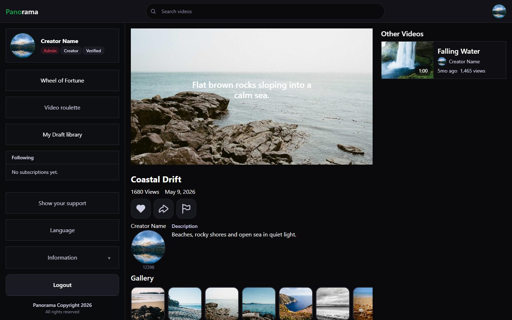</td>
    <td>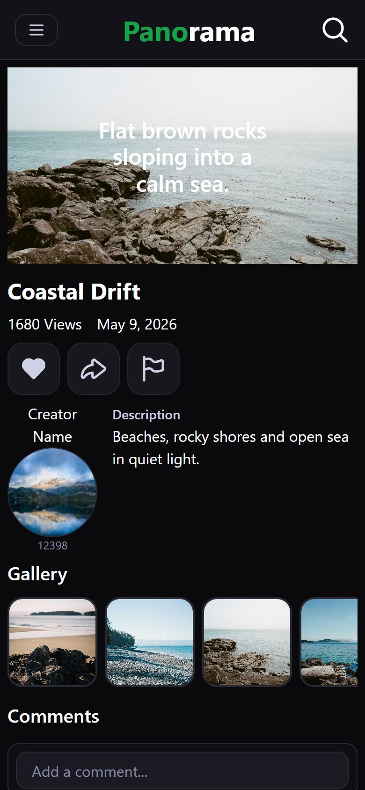</td>
  </tr>
</table>

## Editor

Place images and text on the timeline, style captions (font, outline, shadow, spacing) and preview the result live. Drafts save to your account.

<table>
  <tr>
    <td>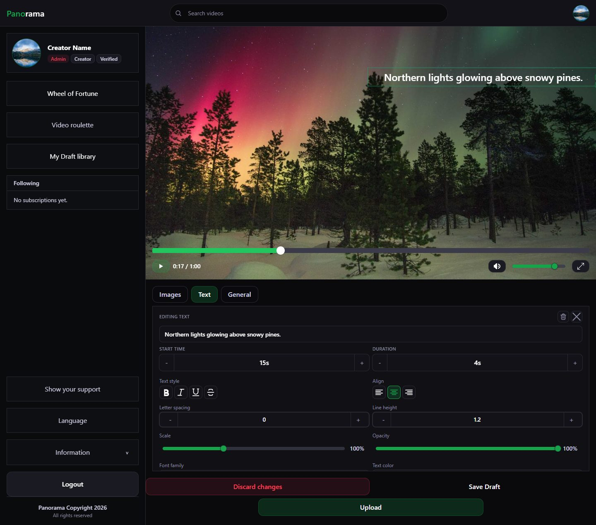</td>
    <td>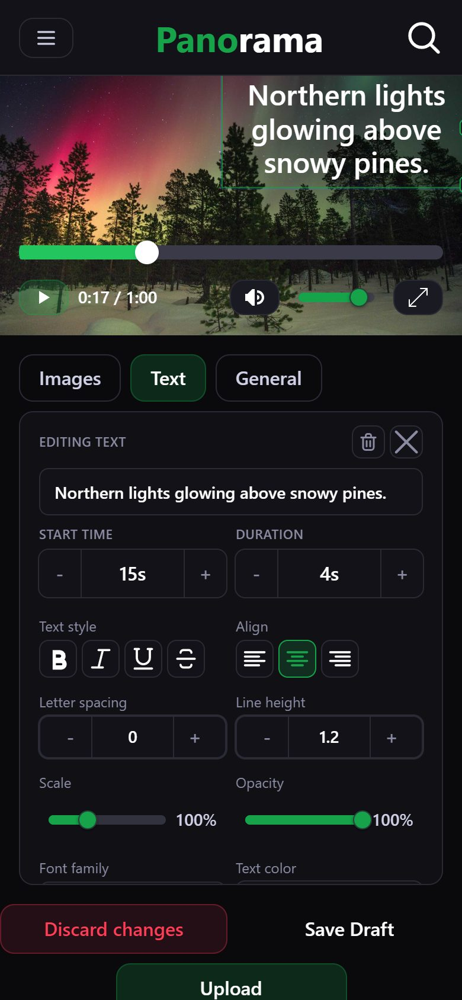</td>
  </tr>
</table>

## Browse

Trending, Most Viewed, Top Rated and Newest feeds, with search and tag, date and length filters.

<table>
  <tr>
    <td>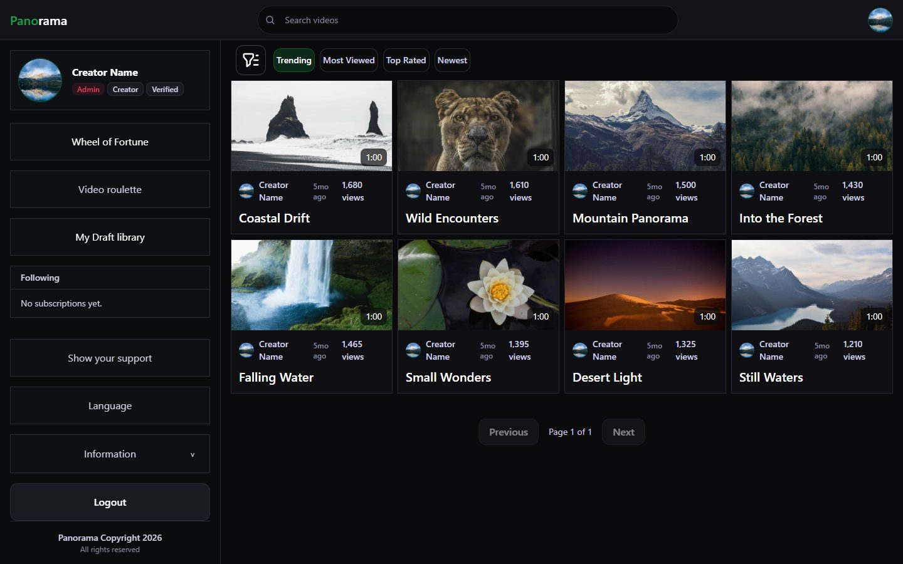</td>
    <td>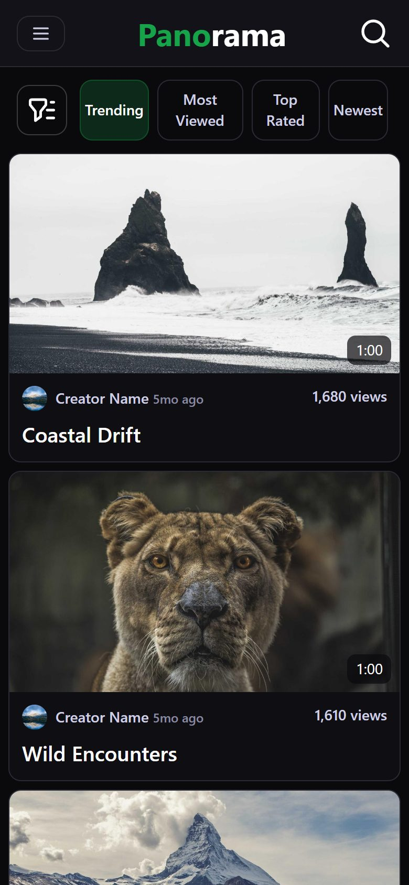</td>
  </tr>
</table>

## Profiles

Public profiles, follows, likes and account settings.

<table>
  <tr>
    <td>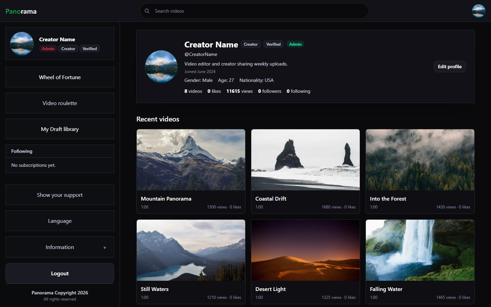</td>
    <td>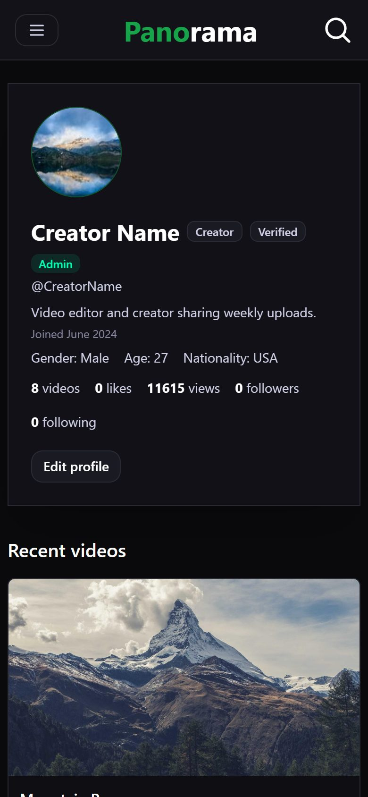</td>
  </tr>
</table>

## More on mobile

<table>
  <tr>
    <td align="center">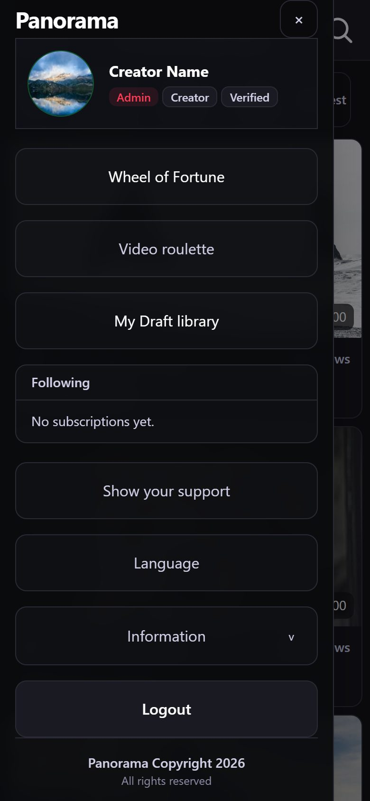<br>Menu</td>
    <td align="center">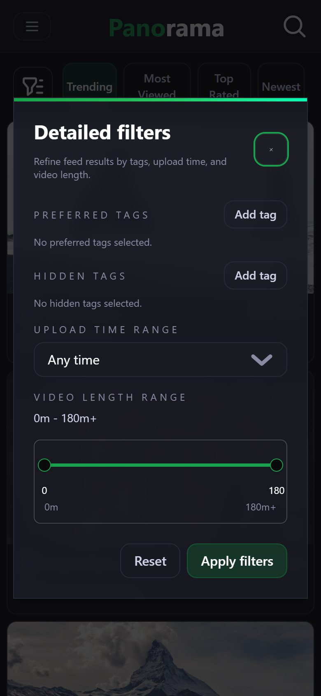<br>Detailed filters</td>
    <td align="center">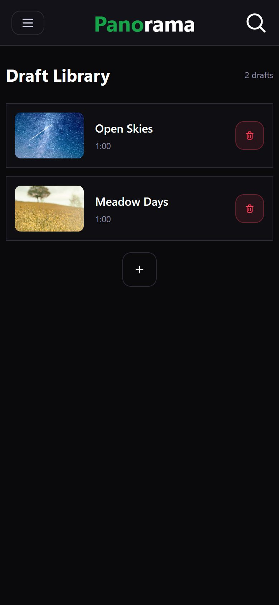<br>Draft library</td>
  </tr>
</table>

## Run it locally

Requires [Docker](https://www.docker.com/) and [Node.js](https://nodejs.org/).

```bash
cd panorama-backend && docker compose up --build    # API on :5252 + PostgreSQL
cd panorama-frontend && npm install && npm run dev  # app on http://localhost:5173
```

Sample data loads automatically. Log in with `creator@example.com` / `Creator123!` (local development only).

<details>
<summary>Project structure</summary>

```
panorama-backend/     ASP.NET Core API: controllers, services, EF Core models, seed data
panorama-frontend/    React app: pages, components, hooks, animation and timeline engine
docs/screenshots/     Images used in this README
```

</details>